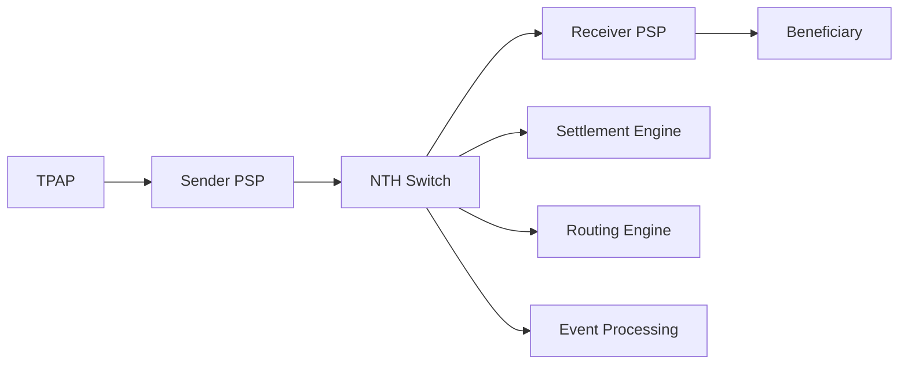

# NTH Module - National Transaction Hub

## Overview

The National Transaction Hub (NTH) is the central payment switch in the SAMPARK ecosystem, similar to NPCI's role in India's payment infrastructure. It acts as the core routing engine that facilitates inter-bank transactions, manages settlement processes, and ensures seamless communication between Payment Service Providers (PSPs).

## Service Details

- **Port**: 3005
- **Container Name**: nth-service
- **Role**: Central payment switch and transaction router
- **Technology**: Node.js with Bun runtime

## Architecture

### Core Responsibilities

1. **Transaction Routing**: Routes payments between different PSP banks
2. **Settlement Coordination**: Manages inter-bank settlement processes
3. **Message Processing**: Handles Kafka-based event processing
4. **Switch Logic**: Implements payment switch logic for different transaction types
5. **Network Management**: Maintains participant registry and routing tables

### Technology Stack

- **Runtime**: Bun
- **Framework**: Express.js + TypeScript
- **Message Broker**: Apache Kafka
- **Caching**: Redis Stack (shared instance)
- **Containerization**: Docker

## Service Dependencies

### Infrastructure Dependencies
- **Kafka**: Message broker for event-driven architecture
- **Zookeeper**: Kafka cluster coordination
- **Redis Stack**: Shared caching and session management
- **Docker Network**: kafka-network for inter-service communication

### Integration Points
- **PSP Banks**: All four bank services for transaction routing
- **TPAP Applications**: Indirect integration through PSP banks

## Environment Variables

```env
NODE_ENV=production
KAFKA_BASEURL=kafka:9092
REDIS_URL=redis://redis-stack:6379
REDIS_HOST=redis-stack
REDIS_PORT=6379
REDIS_PASSWORD=""
REDIS_DB=0
PORT=3000
```

## Transaction Processing

### Supported Transaction Types

#### 1. UPI Transactions
- **Flow**: TPAP → PSP → NTH → PSP → TPAP
- **Routing**: Based on VPA resolution
- **Settlement**: Real-time gross settlement

#### 2. IMPS Transactions
- **Flow**: Remitter Bank → NTH → Beneficiary Bank
- **Routing**: Based on IFSC code and account number
- **Settlement**: Immediate settlement

### Transaction Flow Architecture



## Kafka Integration

### Message Patterns

The NTH processes various Kafka topics for different transaction types:

#### Producer Topics
- `nth.transactions.processed`
- `nth.settlements.initiated`
- `nth.routing.decisions`
- `nth.system.events`

#### Consumer Topics
- `bank.*.transactions.outbound`
- `bank.*.transactions.status`
- `tpap.*.payment.requests`

### Event Processing

```typescript
interface TransactionEvent {
  txnId: string;
  amount: number;
  senderBank: string;
  receiverBank: string;
  senderAccount: string;
  receiverAccount: string;
  transactionType: 'UPI' | 'IMPS';
  status: 'INITIATED' | 'PROCESSING' | 'COMPLETED' | 'FAILED';
  timestamp: Date;
}
```

## Routing Engine

### Bank Registry

The NTH maintains a registry of all participating banks:

```typescript
interface BankRegistry {
  [bankCode: string]: {
    iin: string;
    ifscPrefix: string;
    serviceUrl: string;
    status: 'ACTIVE' | 'INACTIVE';
    supportedServices: string[];
  };
}
```

### Routing Logic

#### VPA-based Routing (UPI)
1. Parse VPA to extract bank identifier
2. Lookup bank service from registry
3. Route transaction to appropriate PSP
4. Handle response and settlement

#### IFSC-based Routing (IMPS)
1. Extract bank code from IFSC
2. Validate account details
3. Route to destination bank
4. Process settlement

## Settlement Engine

### Settlement Process

1. **Transaction Aggregation**: Collect completed transactions
2. **Net Settlement Calculation**: Calculate net positions between banks
3. **Settlement Instruction**: Generate settlement instructions
4. **Confirmation**: Confirm settlement completion

### Settlement Types

- **Real-time**: Individual transaction settlement
- **Batch**: Periodic batch settlement
- **Net Settlement**: Net position settlement between banks

## Redis Usage

### Caching Strategy

- **Transaction Cache**: Active transaction status
- **Routing Cache**: Bank routing information
- **Rate Limiting**: Transaction rate limiting per bank
- **Session Management**: Temporary transaction data

### Cache Keys Pattern

```
nth:transaction:{txnId}
nth:routing:{bankCode}
nth:ratelimit:{bankCode}:{timeWindow}
nth:settlement:{settlementId}
```

## API Endpoints

### Health Check
```http
GET /health
```

Response:
```json
{
  "status": "healthy",
  "services": {
    "kafka": "connected",
    "redis": "connected"
  },
  "timestamp": "2025-01-01T00:00:00Z"
}
```

### Transaction Status
```http
GET /api/v1/transaction/status/:txnId
```

Response:
```json
{
  "txnId": "TXN123456789",
  "status": "COMPLETED",
  "amount": 1000,
  "senderBank": "PVB",
  "receiverBank": "BRG",
  "timestamp": "2025-01-01T00:00:00Z"
}
```

### Bank Registry
```http
GET /api/v1/banks
```

Response:
```json
{
  "banks": [
    {
      "code": "PVB",
      "name": "Paisa Vasool Bank",
      "iin": "321987",
      "ifscPrefix": "PVB",
      "status": "ACTIVE"
    },
    {
      "code": "BRG", 
      "name": "Babu Rao Ganpatrao Bank",
      "iin": "654321",
      "ifscPrefix": "BRG",
      "status": "ACTIVE"
    }
  ]
}
```

## Message Processing Architecture

### Event-Driven Processing

The NTH operates on an event-driven architecture using Kafka:

```typescript
class NTHMessageProcessor {
  async processTransactionRequest(event: TransactionEvent) {
    // 1. Validate transaction
    await this.validateTransaction(event);
    
    // 2. Route to destination bank
    const routing = await this.getRoutingInfo(event.receiverBank);
    
    // 3. Process settlement
    await this.processSettlement(event);
    
    // 4. Publish status update
    await this.publishStatusUpdate(event);
  }
}
```

### Message Schemas

#### Transaction Request Schema
```json
{
  "$schema": "http://json-schema.org/draft-07/schema#",
  "type": "object",
  "properties": {
    "txnId": {"type": "string"},
    "amount": {"type": "number", "minimum": 0.01},
    "senderVpa": {"type": "string"},
    "receiverVpa": {"type": "string"},
    "transactionType": {"enum": ["UPI", "IMPS"]},
    "metadata": {"type": "object"}
  },
  "required": ["txnId", "amount", "transactionType"]
}
```

## Error Handling & Resilience

### Circuit Breaker Pattern

The NTH implements circuit breakers for bank integrations:

```typescript
interface CircuitBreakerConfig {
  failureThreshold: number;
  recoveryTimeout: number;
  monitoringPeriod: number;
}
```

### Retry Mechanism

Failed transactions are retried with exponential backoff:

```typescript
interface RetryConfig {
  maxRetries: number;
  baseDelay: number;
  maxDelay: number;
  exponentialBase: number;
}
```

### Error Response Format

```json
{
  "status": "Error",
  "code": "TRANSACTION_ROUTING_FAILED",
  "message": "Unable to route transaction to destination bank",
  "txnId": "TXN123456789",
  "timestamp": "2025-01-01T00:00:00Z",
  "details": {
    "reason": "Destination bank service unavailable",
    "retryAfter": 30
  }
}
```

## Performance & Scalability

### Throughput Optimization

- **Async Processing**: Non-blocking I/O for high throughput
- **Connection Pooling**: Efficient resource utilization
- **Message Batching**: Batch processing for high-volume transactions
- **Load Balancing**: Horizontal scaling capabilities

### Caching Strategy

- **Hot Cache**: Frequently accessed routing information
- **Write-Through**: Transaction status updates
- **TTL Management**: Time-based cache expiration

## Monitoring & Observability

### Key Metrics

- **Transaction Volume**: TPS (Transactions Per Second)
- **Success Rate**: Transaction success percentage
- **Latency**: Average/P95/P99 response times
- **Error Rate**: Failed transaction percentage

### Logging

Structured logging for transaction traceability:

```json
{
  "timestamp": "2025-01-01T00:00:00Z",
  "level": "INFO",
  "service": "nth-switch",
  "txnId": "TXN123456789",
  "event": "transaction_routed",
  "senderBank": "PVB",
  "receiverBank": "BRG",
  "amount": 1000,
  "processingTime": 150
}
```

### Health Checks

Comprehensive health monitoring:

```typescript
interface HealthStatus {
  overall: 'healthy' | 'degraded' | 'unhealthy';
  components: {
    kafka: ComponentHealth;
    redis: ComponentHealth;
    database: ComponentHealth;
    bankConnections: BankConnectionHealth[];
  };
  uptime: number;
  version: string;
}
```

## Development Setup

### Local Development

1. Clone and navigate to NTH directory:
```bash
cd nth
```

2. Install dependencies:
```bash
bun install
```

3. Set up environment variables:
```bash
cp .env.example .env
```

4. Start dependencies (Kafka, Redis):
```bash
docker-compose up kafka redis-stack -d
```

5. Run seed data:
```bash
bun run seed
```

6. Start development server:
```bash
bun run dev
```

### Docker Development

Start NTH service with dependencies:
```bash
docker-compose up nth-switch kafka redis-stack -d
```

View real-time logs:
```bash
docker-compose logs -f nth-switch
```

## Testing

### Test Categories

```bash
# Unit tests
bun test

# Integration tests  
bun test:integration

# Load tests
bun test:load

# End-to-end tests
bun test:e2e
```

### Mock Services

For testing, mock bank services are available:

```typescript
class MockBankService {
  async processTransaction(request: TransactionRequest): Promise<TransactionResponse> {
    // Mock implementation for testing
  }
}
```

## Security

### Transaction Security

- **Message Signing**: Cryptographic message signing
- **Replay Protection**: Nonce-based replay attack prevention  
- **Input Validation**: Strict input sanitization
- **Rate Limiting**: Per-bank transaction rate limits

### Network Security

- **TLS Encryption**: All inter-service communication encrypted
- **Network Isolation**: Docker network segmentation
- **Access Control**: Service-to-service authentication

## Compliance & Auditing

### Transaction Audit Trail

Complete transaction logging for compliance:

```typescript
interface AuditLog {
  txnId: string;
  timestamp: Date;
  event: string;
  senderBank: string;
  receiverBank: string;
  amount: number;
  status: string;
  processingNode: string;
}
```

### Regulatory Compliance

- **Transaction Reporting**: Automated regulatory reporting
- **Data Retention**: Configurable data retention policies
- **Privacy Protection**: PII data handling compliance

## Deployment

### Production Deployment

```bash
# Build production image
docker build -t nth-switch:latest .

# Deploy with production configuration
docker-compose -f docker-compose.prod.yml up -d nth-switch
```

### Kubernetes Deployment

```yaml
apiVersion: apps/v1
kind: Deployment
metadata:
  name: nth-switch
spec:
  replicas: 3
  selector:
    matchLabels:
      app: nth-switch
  template:
    metadata:
      labels:
        app: nth-switch
    spec:
      containers:
      - name: nth-switch
        image: nth-switch:latest
        ports:
        - containerPort: 3000
```

## Configuration Management

### Environment-based Configuration

```typescript
interface NTHConfig {
  kafka: KafkaConfig;
  redis: RedisConfig;
  banks: BankConfig[];
  settlement: SettlementConfig;
  monitoring: MonitoringConfig;
}
```

### Feature Flags

Dynamic feature toggling:

```typescript
interface FeatureFlags {
  enableBatchSettlement: boolean;
  enableCircuitBreaker: boolean;
  enableTransactionCaching: boolean;
  maxTransactionAmount: number;
}
```